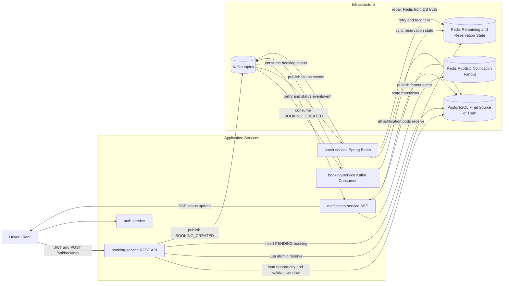
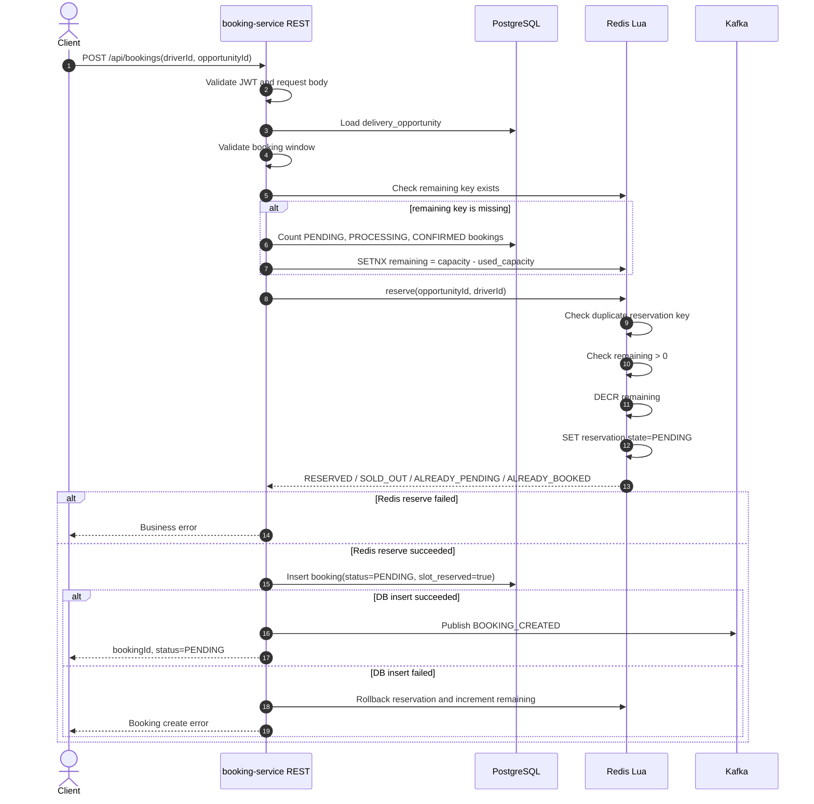
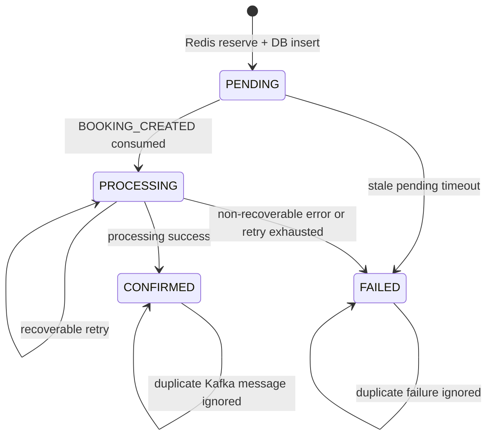
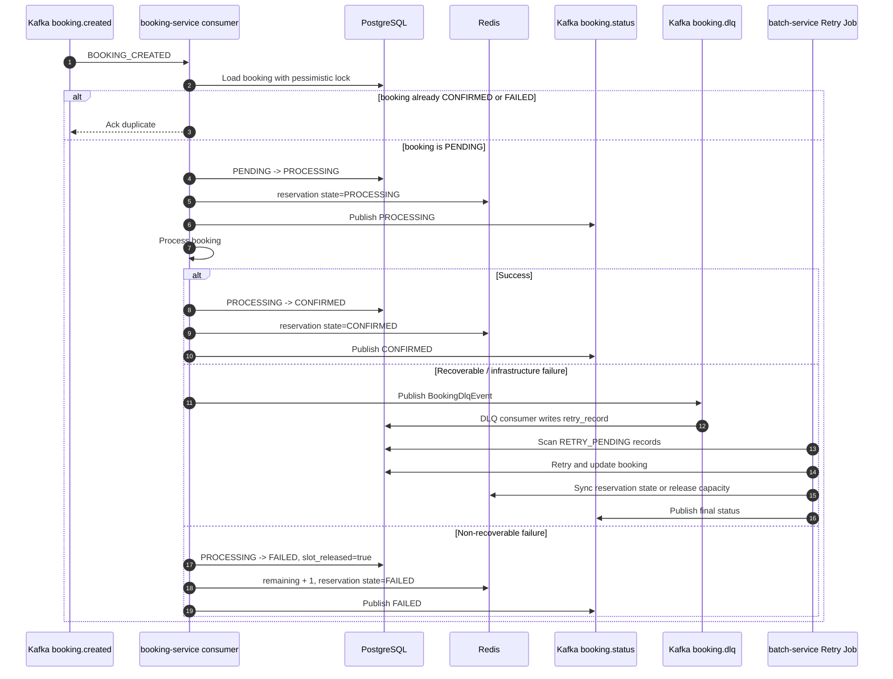
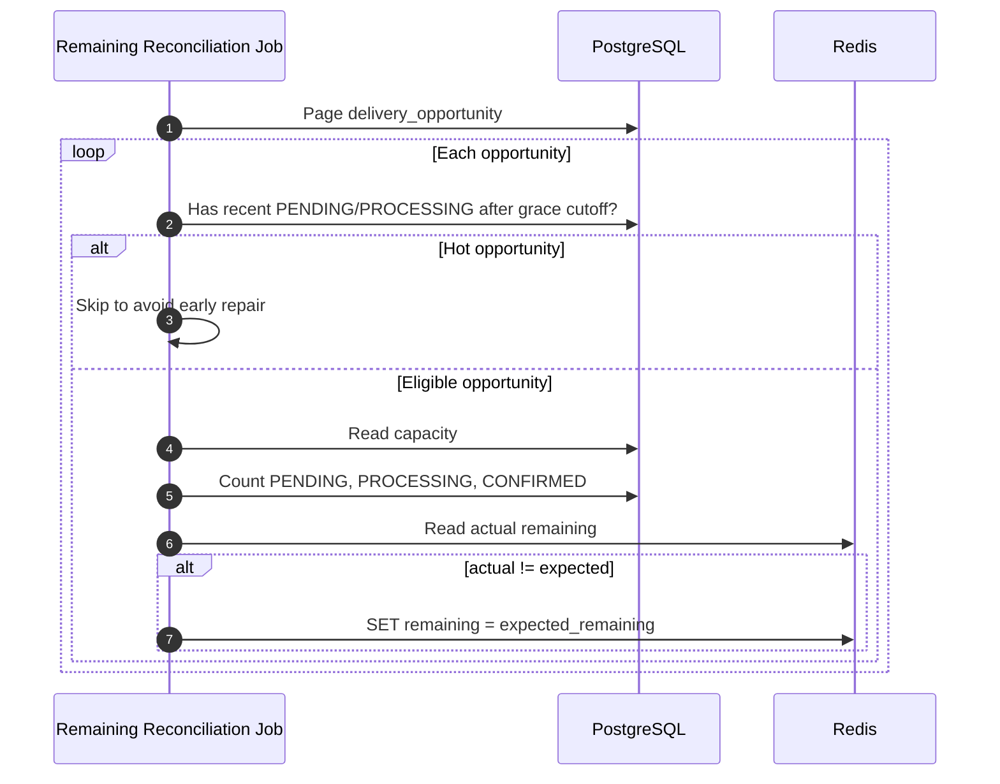
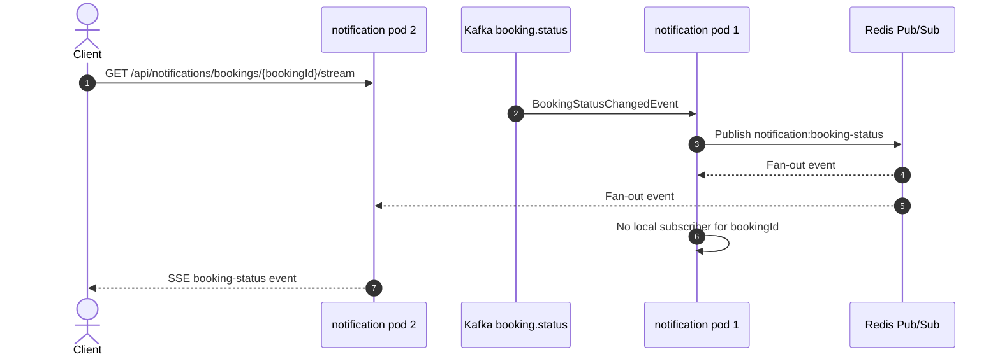

# Delivery Booking System

Take-home Java 21 microservices project for booking delivery opportunities under high concurrency.

The design goal is to prevent overselling while keeping the booking request path fast. PostgreSQL remains the final source of truth, while Redis handles realtime capacity reservation and Kafka decouples asynchronous processing, retry, reconciliation, and notification.

## Tech Stack

| Area | Technology |
| --- | --- |
| Language | Java 21 |
| Framework | Spring Boot 3.x |
| API | Spring Web |
| Persistence | Spring Data JPA, PostgreSQL, Flyway |
| Messaging | Spring Kafka, Kafka |
| Batch | Spring Batch |
| Cache / reservation layer | Redis, Redis Lua scripts |
| Scheduler lock | ShedLock with Redis |
| Security | Spring Security, simplified JWT validation |
| Notification | Server-Sent Events, Redis Pub/Sub fan-out |
| Build | Maven |
| Boilerplate | Lombok |
| Local infra | Docker Compose |

## Architecture Summary

The system is split into four services:

| Service | Main role |
| --- | --- |
| `auth-service` | Auth boundary placeholder. JWT validation is simplified in `booking-service` for this exercise. |
| `booking-service` | Booking API, Redis atomic reservation, DB insert, Kafka producer/consumer, DLQ retry-record creation. |
| `batch-service` | Spring Batch jobs for retry, stuck-status reconciliation, and Redis remaining-capacity reconciliation. |
| `notification-service` | Consumes booking status events and pushes updates to clients through SSE. |

Core design choices:

- **DB is final truth**: booking state, retry records, dedup constraints, and audit history live in PostgreSQL.
- **Redis is the realtime reservation layer**: remaining capacity and reservation state are updated atomically with Lua.
- **Kafka decouples side effects**: API returns `PENDING`, then consumers process status transitions asynchronously.
- **Batch repairs failures**: delayed retry, stale states, and Redis drift are handled outside the request path.
- **ShedLock prevents duplicate scheduled jobs**: only one pod runs each batch job at a time.
- **Redis Pub/Sub supports multi-pod SSE**: status events fan out to all notification pods, and only the pod holding the client connection pushes the event.

## Diagram 1: System Architecture



## Diagram 2: Booking Request Sequence

The request path keeps DB access limited:

- Load `delivery_opportunity` from DB to validate the booking window.
- Check Redis remaining key.
- Only if Redis remaining is missing, count DB bookings to initialize Redis.
- Reserve capacity through Redis Lua.
- Insert the booking as `PENDING` in DB.
- Publish `BOOKING_CREATED`.



## Diagram 3: Booking State Machine



Capacity lifecycle:

| Moment | DB state | Redis remaining | Redis reservation state |
| --- | --- | --- | --- |
| Reserve success | `PENDING`, `slot_reserved=true`, `slot_released=false` | `remaining - 1` | `PENDING` |
| Confirm success | `CONFIRMED` | unchanged | `CONFIRMED` |
| Final failure | `FAILED`, `slot_released=true` | `remaining + 1` | `FAILED` |

`slot_reserved` and `slot_released` are idempotency guards. They prevent duplicate consumers or retry jobs from releasing the same capacity more than once.

## Diagram 4: Async Processing And Retry



## Diagram 5: Batch Reconciliation Jobs

`batch-service` has exactly three jobs.

```mermaid
flowchart TB
    Scheduler[BatchJobScheduler<br/>@Scheduled + @SchedulerLock]

    Scheduler --> RetryJob[1. Retry Job]
    Scheduler --> StatusJob[2. Status Reconciliation Job]
    Scheduler --> RemainingJob[3. Remaining Reconciliation Job]

    RetryJob -->|scan retry_record<br/>RETRY_PENDING and next_retry_at <= now| RetryRecord[(retry_record)]
    RetryJob -->|confirm or final fail| Booking[(booking)]
    RetryJob -->|sync reservation / release capacity| Redis[(Redis)]
    RetryJob -->|publish status| StatusTopic[Kafka booking.status]

    StatusJob -->|find stale PENDING / PROCESSING| Booking
    StatusJob -->|create retry_record or fail booking| RetryRecord
    StatusJob -->|repair reservation state| Redis

    RemainingJob -->|read capacity| Opportunity[(delivery_opportunity)]
    RemainingJob -->|count PENDING / PROCESSING / CONFIRMED| Booking
    RemainingJob -->|set expected remaining| Redis
```

### Retry Job

- Scans `retry_record` where `retry_status = RETRY_PENDING` and `next_retry_at <= now`.
- If booking is already `CONFIRMED`, closes the retry as `RETRY_SUCCEEDED`.
- If booking is already `FAILED` and `slot_released=true`, closes the retry as `RETRY_EXHAUSTED`.
- On retry success, confirms the booking and publishes `CONFIRMED`.
- On retry exhaustion, fails the booking, releases Redis capacity once, and publishes `FAILED`.

### Status Reconciliation Job

- Finds stale `PENDING` bookings and fails them if no recovery exists.
- Finds stale `PROCESSING` bookings and creates retry records first.
- Cleans orphan Redis reservations when no DB booking exists.

### Remaining Reconciliation Job

- Works at opportunity level.
- Skips hot opportunities with recent `PENDING` or `PROCESSING` DB bookings.
- Calculates `expected_remaining = capacity - count(PENDING, PROCESSING, CONFIRMED)`.
- Repairs Redis remaining from DB truth only.
- Never updates DB from Redis.



## Diagram 6: Multi-Pod Notification

SSE connections are held in memory by the pod that accepted the client connection. To support multiple notification pods, `notification-service` fans Kafka status events out through Redis Pub/Sub.



Endpoint:

```http
GET /api/notifications/bookings/{bookingId}/stream
Accept: text/event-stream
```

## Data Model

| Table | Purpose |
| --- | --- |
| `delivery_opportunity` | Opportunity metadata, booking window, and total capacity. |
| `booking` | Final booking state plus capacity-release idempotency flags. |
| `retry_record` | Durable retry queue for recoverable failures. |
| `booking_state_history` | State transition audit trail. |

Important invariant:

```sql
unique(opportunity_id, driver_id)
```

Used capacity:

```text
used_capacity = count(bookings where status in PENDING, PROCESSING, CONFIRMED)
expected_remaining = delivery_opportunity.capacity - used_capacity
```

## Code Map

| Area | Files |
| --- | --- |
| Booking request path | `booking-service/.../BookingController`, `BookingService`, `BookingReservationStore`, Redis Lua scripts |
| Booking consumer path | `BookingCreatedConsumer`, `BookingStateTransitionService`, `BookingDeadLetterConsumer` |
| Retry job | `batch-service/.../job/retry/*`, `BookingRetryTransitionService`, `RetryBookingProcessingService` |
| Status reconciliation | `batch-service/.../job/reconciliation/*`, `StatusReconciliationService` |
| Remaining reconciliation | `batch-service/.../job/remaining/*`, `RemainingReconciliationService` |
| Scheduling and lock | `BatchJobScheduler`, `BatchJobLauncherService`, `ShedLockConfig` |
| Notification | `BookingStatusEventConsumer`, `BookingStatusRedisFanoutService`, `BookingStatusPushService` |

## Scheduling

| Job | Delay | Initial Delay | Lock At Most | Lock At Least |
| --- | --- | --- | --- | --- |
| Retry Job | `PT30S` | `PT10S` | `PT5M` | `PT1S` |
| Status Reconciliation Job | `PT1M` | `PT20S` | `PT10M` | `PT1S` |
| Remaining Reconciliation Job | `PT2M` | `PT30S` | `PT10M` | `PT1S` |

ShedLock is enabled with:

```java
@EnableScheduling
@EnableSchedulerLock(defaultLockAtMostFor = "PT10M")
```

## Local Infrastructure

`docker-compose.yml` starts:

- PostgreSQL 16
- Redis 7
- Kafka 3.8

Kafka topic auto-creation is disabled. Create these topics:

```text
booking.created
booking.status
booking.dlq
```

## Consistency Rules

- DB is the final source of truth.
- Redis is optimized for realtime reservation only.
- Redis Lua prevents overselling by checking remaining capacity and duplicate reservation atomically.
- `opportunityId + driverId` is the business deduplication key.
- DB unique constraint is the final duplicate guard.
- `slot_released` prevents duplicate capacity release.
- Kafka consumers check DB state before every transition.
- Batch jobs repair stuck DB state and Redis drift.
