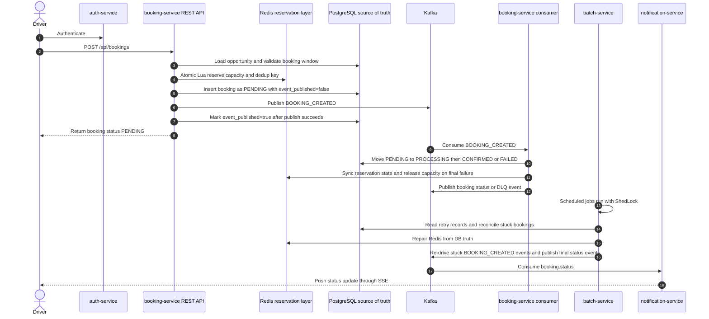
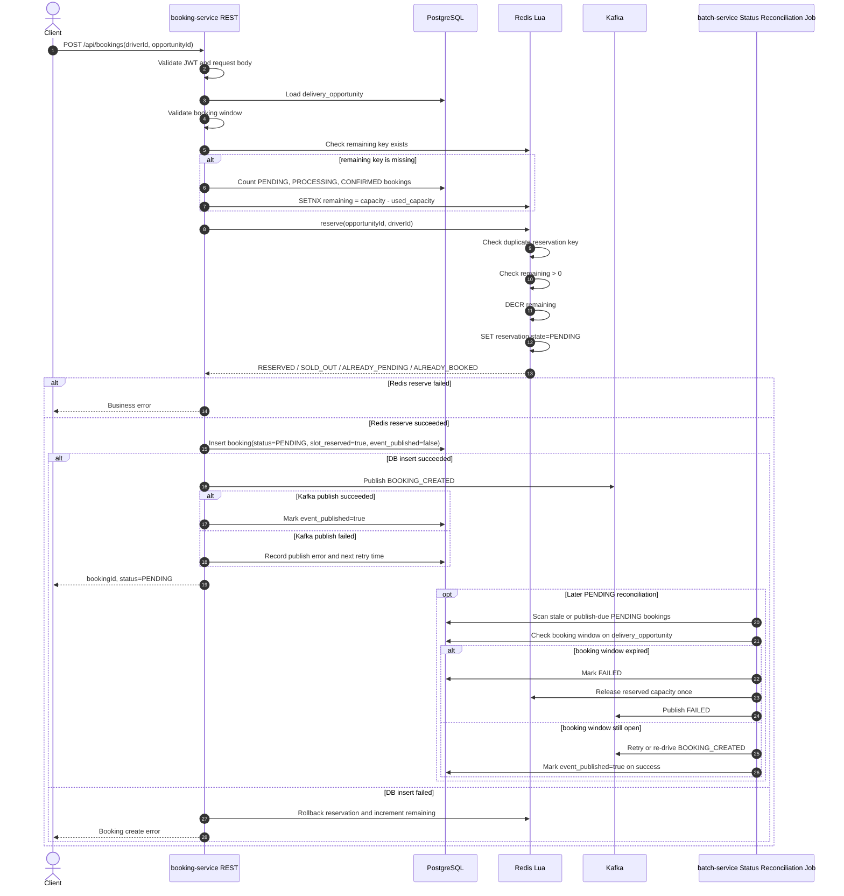
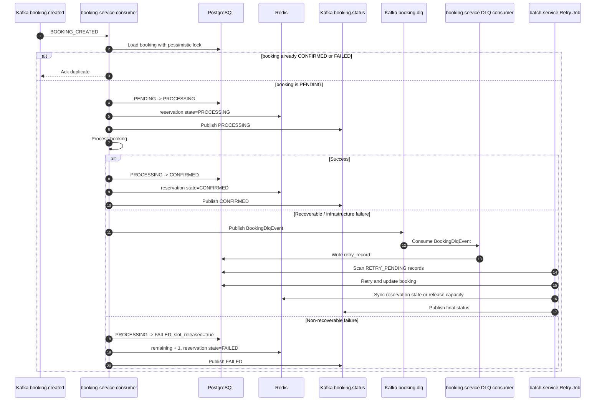
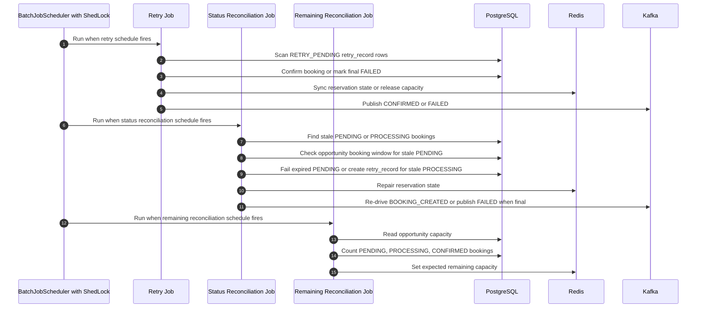
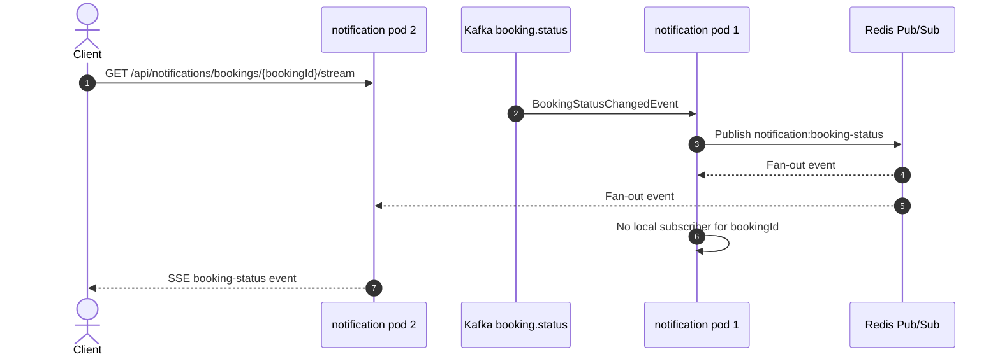

# Delivery Booking System

Take-home Java 21 microservices project for booking delivery opportunities under high concurrency.

The design goal is to prevent overselling, keep the first-come-first-served booking path low-latency, and stay fault tolerant under retries, duplicate messages, Kafka publish failures, and partial failures. PostgreSQL remains the final source of truth, Redis handles realtime atomic reservation, and Kafka decouples asynchronous processing, retry, reconciliation, and notification.

## Tech Stack

| Area | Technology |
| --- | --- |
| Language | Java 21 |
| Framework | Spring Boot 3.x |
| API | Spring Web |
| Persistence | Spring Data JPA, PostgreSQL, Flyway |
| Messaging | Spring Kafka, Kafka |
| Batch | Spring Batch |
| Cache / reservation layer | Redis, Redis Lua scripts |
| Scheduler lock | ShedLock with Redis |
| Security | Spring Security, simplified JWT validation |
| Notification | Server-Sent Events, Redis Pub/Sub fan-out |
| Build | Maven |
| Boilerplate | Lombok |
| Local infra | Docker Compose |

## Architecture Summary

The system is split into four services:

| Service | Main role |
| --- | --- |
| `auth-service` | Auth boundary placeholder. JWT validation is simplified in `booking-service` for this exercise. |
| `booking-service` | Booking API, Redis atomic reservation, DB insert, booking-created publish retry marker, Kafka producer/consumer, DLQ retry-record creation. |
| `batch-service` | Spring Batch jobs for retry, stuck-status reconciliation, and Redis remaining-capacity reconciliation. |
| `notification-service` | Consumes booking status events and pushes updates to clients through SSE. |

Core design choices:

- **DB is final truth**: booking state, retry records, dedup constraints, and audit history live in PostgreSQL.
- **Redis is the realtime reservation layer**: remaining capacity and reservation state are updated atomically with Lua.
- **Kafka decouples side effects**: the API reserves capacity and returns `PENDING`, then consumers process status transitions asynchronously.
- **Booking-created publish is recoverable**: `BOOKING_CREATED` is published inline for low latency, while `Status Reconciliation Job` can retry or re-drive the event if the booking remains `PENDING`.
- **Batch repairs failures**: delayed retry, stale states, and Redis drift are handled outside the request path.
- **ShedLock prevents duplicate scheduled jobs**: only one pod runs each batch job at a time.
- **Redis Pub/Sub supports multi-pod SSE**: status events fan out to all notification pods, and only the pod holding the client connection pushes the event.

## Assumptions

- A booking is for one driver and one delivery opportunity.
- Drivers are authenticated before booking. This project keeps JWT validation simplified in `booking-service`.
- Opportunity capacity is known before the booking window opens.
- A delivery opportunity belongs to one region and one zone.
- A successful booking gives the driver the right to later arrive at the facility and receive a route.
- Downstream facility or route assignment is outside this booking system.

## Diagram 1: High-Level System Sequence



## Diagram 2: Booking Request Sequence

The request path keeps DB access limited:

- Load `delivery_opportunity` from DB to validate the booking window.
- Check Redis remaining key.
- Only if Redis remaining is missing, count DB bookings to initialize Redis.
- Reserve capacity through Redis Lua.
- Insert the booking as `PENDING` in DB with `booking_created_event_published=false`.
- Publish `BOOKING_CREATED` inline.
- Mark `booking_created_event_published=true` after publish succeeds.
- If inline publish fails, keep the booking `PENDING` and let `Status Reconciliation Job` retry it.



Capacity lifecycle:

| Moment | DB state | Redis remaining | Redis reservation state |
| --- | --- | --- | --- |
| Reserve success | `PENDING`, `slot_reserved=true`, `slot_released=false` | `remaining - 1` | `PENDING` |
| Confirm success | `CONFIRMED` | unchanged | `CONFIRMED` |
| Final failure | `FAILED`, `slot_released=true` | `remaining + 1` | `FAILED` |

`slot_reserved` and `slot_released` are idempotency guards. They prevent duplicate consumers or retry jobs from releasing the same capacity more than once.

## Diagram 3: Async Processing And Retry



## Diagram 4: Batch Jobs Sequence

`batch-service` has exactly three Spring Batch jobs.



### Retry Job

- Scans `retry_record` where `retry_status = RETRY_PENDING` and `next_retry_at <= now`.
- If booking is already `CONFIRMED`, closes the retry as `RETRY_SUCCEEDED`.
- If booking is already `FAILED` and `slot_released=true`, closes the retry as `RETRY_EXHAUSTED`.
- On retry success, confirms the booking and publishes `CONFIRMED`.
- On retry exhaustion, fails the booking, releases Redis capacity once, and publishes `FAILED`.

### Status Reconciliation Job

- Finds stale `PENDING` bookings and publish-due `PENDING` bookings where `BOOKING_CREATED` was not delivered.
- Loads `delivery_opportunity` and checks the booking window before recovery.
- If the booking window has expired, it marks the booking `FAILED`, releases Redis capacity once, and publishes `FAILED`.
- If the booking window is still open and `BOOKING_CREATED` was never published, it publishes the event and marks `booking_created_event_published=true` on success.
- If the event was already published but the booking is still `PENDING`, it re-publishes `BOOKING_CREATED` without resetting the publish marker. This is safe because the consumer is idempotent and only processes bookings that are still `PENDING`.
- Only after retry exhaustion does it mark stale `PENDING` as `FAILED`, release Redis capacity once, and publish `FAILED`.
- Finds stale `PROCESSING` bookings and creates retry records first because processing already started and should be retried before final failure.
- Marks stale `PROCESSING` as `FAILED` only when retry attempts are exhausted.
- Cleans orphan Redis reservations when no DB booking exists.

### Remaining Reconciliation Job

- Works at opportunity level.
- Skips hot opportunities with recent `PENDING` or `PROCESSING` DB bookings.
- Calculates `expected_remaining = capacity - count(PENDING, PROCESSING, CONFIRMED)`.
- Repairs Redis remaining from DB truth only.
- Never updates DB from Redis.

## Diagram 5: Multi-Pod Notification

SSE connections are held in memory by the pod that accepted the client connection. To support multiple notification pods, `notification-service` fans Kafka status events out through Redis Pub/Sub.



Endpoint:

```http
GET /api/notifications/bookings/{bookingId}/stream
Accept: text/event-stream
```

## Data Model

| Table | Purpose |
| --- | --- |
| `delivery_opportunity` | Opportunity metadata, region, zone, booking window, and total capacity. |
| `booking` | Final booking state, capacity-release idempotency flags, and booking-created Kafka publish marker. |
| `retry_record` | Durable retry queue for recoverable failures. |
| `booking_state_history` | State transition audit trail. |

Important invariant:

```sql
unique(opportunity_id, driver_id)
```

Used capacity:

```text
used_capacity = count(bookings where status in PENDING, PROCESSING, CONFIRMED)
expected_remaining = delivery_opportunity.capacity - used_capacity
```

## Code Map

| Area | Files |
| --- | --- |
| Booking request path | `booking-service/.../BookingController`, `BookingService`, `BookingReservationStore`, Redis Lua scripts |
| Booking-created publish recovery | `booking-service/.../BookingCreatedEventPublishService`, `batch-service/.../StatusReconciliationService` |
| Booking consumer path | `BookingCreatedConsumer`, `BookingStateTransitionService`, `BookingDeadLetterConsumer` |
| Retry job | `batch-service/.../job/retry/*`, `BookingRetryTransitionService`, `RetryBookingProcessingService` |
| Status reconciliation | `batch-service/.../job/reconciliation/*`, `StatusReconciliationService` |
| Remaining reconciliation | `batch-service/.../job/remaining/*`, `RemainingReconciliationService` |
| Scheduling and lock | `BatchJobScheduler`, `BatchJobLauncherService`, `ShedLockConfig` |
| Notification | `BookingStatusEventConsumer`, `BookingStatusRedisFanoutService`, `BookingStatusPushService` |

## Scheduling

| Job | Delay | Initial Delay | Lock At Most | Lock At Least |
| --- | --- | --- | --- | --- |
| Retry Job | `PT30S` | `PT10S` | `PT5M` | `PT1S` |
| Status Reconciliation Job | `PT1M` | `PT20S` | `PT10M` | `PT1S` |
| Remaining Reconciliation Job | `PT2M` | `PT30S` | `PT10M` | `PT1S` |

ShedLock is enabled with:

```java
@EnableScheduling
@EnableSchedulerLock(defaultLockAtMostFor = "PT10M")
```

## Local Infrastructure

`docker-compose.yml` starts the local infrastructure and services:

- PostgreSQL 16
- Redis 7
- Kafka 3.8
- auth-service
- booking-service
- batch-service
- notification-service

Start the full local microservice stack:

```bash
docker compose up --build
```

Kafka topic auto-creation is disabled; the compose file creates the required `booking.created`, `booking.status`, and `booking.dlq` topics through the `kafka-init` container.

Local service ports:

| Service | Host Port |
| --- | --- |
| auth-service | `8081` |
| booking-service | `8082` |
| notification-service | `8083` |
| batch-service | no HTTP port |

## Consistency Rules

- DB is the final source of truth.
- Redis is optimized for realtime reservation only.
- Redis Lua prevents overselling by checking remaining capacity and duplicate reservation atomically.
- `opportunityId + driverId` is the business deduplication key.
- DB unique constraint is the final duplicate guard.
- `booking_created_event_published=false` means the booking exists in DB but `BOOKING_CREATED` still needs to be delivered to Kafka.
- `slot_released` prevents duplicate capacity release.
- Kafka consumers check DB state before every transition.
- Batch jobs repair stuck DB state and Redis drift.

## Tradeoffs And Alternatives

| Decision | Why |
| --- | --- |
| Redis Lua reservation instead of DB pessimistic locking on every request | Keeps the hot booking path low-latency under heavy concurrency while still making the capacity decrement and duplicate reservation check atomic. |
| PostgreSQL as final source of truth | Redis can be repaired or rebuilt, but final booking state, retry records, dedup constraints, and history need durable transactional storage. |
| Kafka async processing after `PENDING` booking insert | The API can return quickly after reserving capacity and persisting the booking, while slower side effects are handled by consumers. |
| Booking-level publish marker instead of a full outbox table | This project has one critical initial event, so a small marker on `booking` keeps the model simple while still recovering from Kafka publish failure after DB commit. |
| Batch reconciliation instead of handling every recovery inline | Keeps request handling simple and gives the system a durable way to recover from partial failures, stale states, and Redis drift. |
| `slot_reserved` and `slot_released` flags | Capacity release must be idempotent because Kafka messages and retry jobs can run more than once. |

## Future Enhancement

If business later requires prioritization by zone, region, proximity, or driver quality, the system can be extended from first-come-first-served booking to a priority-based allocation model using candidate pooling and short allocation windows before final Redis reservation.
